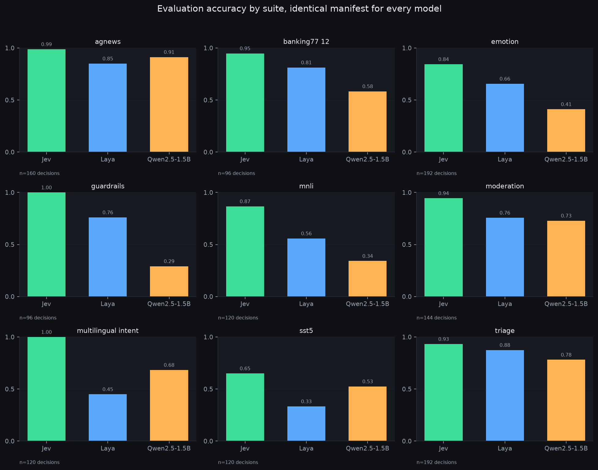
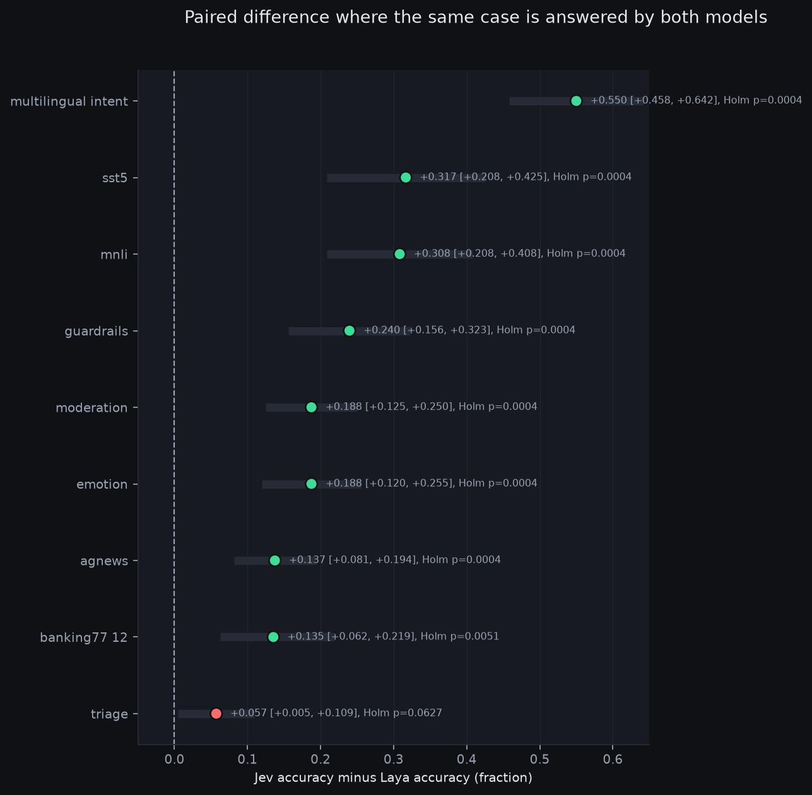
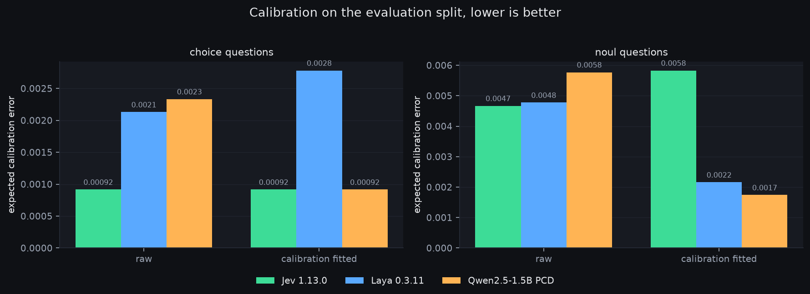
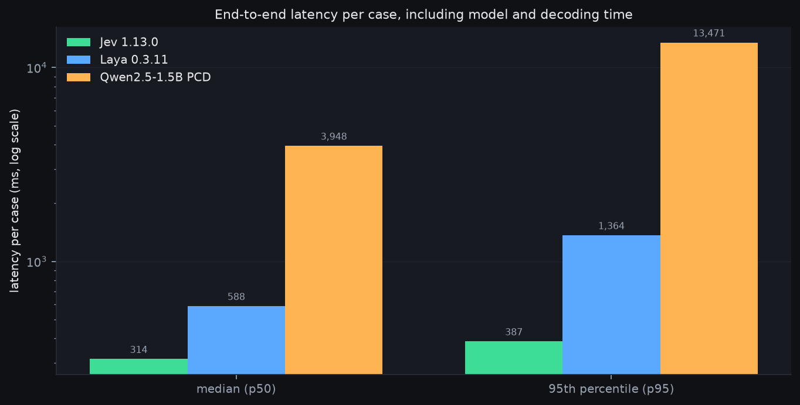
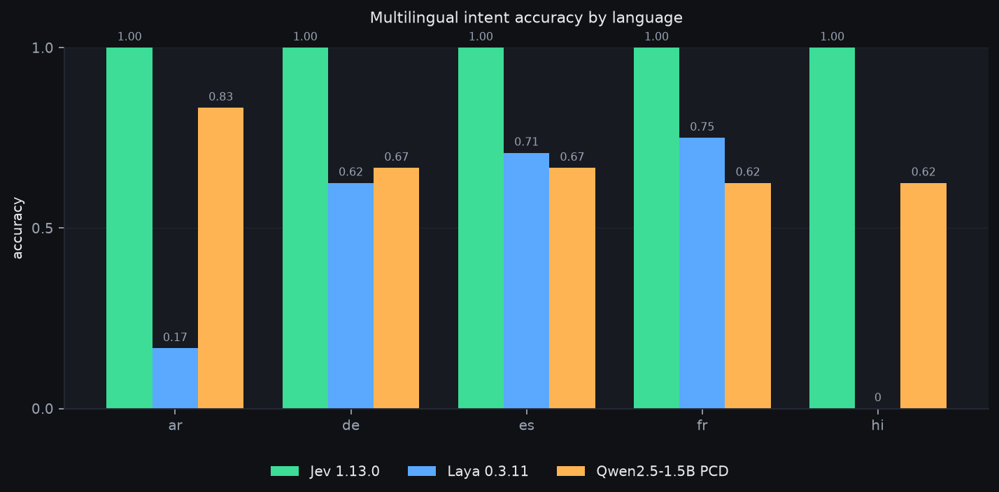

# sysone-bench v2.0.0 results

Three models, one manifest, one seed. Every number below was recomputed from the raw
prediction rows of the three runs and then checked against each run's own sealed
`summary.json`. The check is a gate, not a comment: `benchmark/report.py` refuses to
write a report if a single recomputed count or per-suite accuracy disagrees.

- manifest raw SHA-256 `a938cc2483a592dc84e0d5baac12594491bcaa5b4ceb6b7c3b0def71b36297bd`
- manifest logical digest `4272a7a25ebcb324235696ad808544e157a31e3f9c04421da731a08dfb9d5768`
- 1,190 cases, 1,550 decisions, 9 suites; 238 calibration and 952 evaluation cases
- evaluation split: 952 cases, 1,240 scored decisions
- seed 42, metric schema 2, CPU only, no GPU anywhere in this run

## What was compared

| model | identity | serving |
|---|---|---|
| Jev | `jev-1.13.0` | closed API, `api.typesafe.ai/v1/systemone` |
| Laya | `convaiinnovations/laya`, package 0.3.11, commit `55cf4c4ebb4ebe31b2550e8bdf3bd21b99753851`, root checkpoint | local, CPU |
| Qwen PCD | `Qwen/Qwen2.5-1.5B-Instruct`, revision `989aa7980e4cf806f80c7fef2b1adb7bc71aa306` | local, CPU |

Each container was limited to 4 CPUs and 12 GB on a CPU-only host with no GPU. Laya and
Qwen ran against a dedicated model cache; Jev's latency is measured over the network from
that same host, so treat it as a deployment observation rather than a lab number.

## Accuracy

| suite | decisions | Jev | Laya | Qwen PCD |
|---|---|---|---|---|
| agnews | 160 | 0.9875 | 0.8500 | 0.9125 |
| banking77, 12 intents | 96 | 0.9479 | 0.8125 | 0.5833 |
| emotion, 6 labels | 192 | 0.8438 | 0.6562 | 0.4115 |
| guardrails | 96 | 1.0000 | 0.7604 | 0.2917 |
| mnli, 3-way | 120 | 0.8667 | 0.5583 | 0.3417 |
| moderation | 144 | 0.9444 | 0.7569 | 0.7292 |
| multilingual intent, 5 languages | 120 | 1.0000 | 0.4500 | 0.6833 |
| sst5, 5 levels, scored | 120 | 0.6500 | 0.3333 | 0.5250 |
| triage, 5 intents | 192 | 0.9323 | 0.8750 | 0.7812 |
| **all suites** | **1,240** | **0.9065** | **0.6863** | **0.6048** |



Jev wins every suite. The two open models disagree about where they are weak. Qwen beats
Laya on agnews (0.9125 against 0.8500) and on multilingual intent (0.6833 against 0.4500,
a 23 point gap), while Laya is stronger on emotion, mnli and the five-way triage intent
question. Qwen is the weaker of the two on guardrails, where it scores 0.2917 against
Laya's 0.7604, and on banking77, 0.5833 against 0.8125.

Those two Qwen failures have different causes and it is worth separating them. banking77
is a 12-way intent question, so a constrained decoder has the most options to get wrong.
Guardrails is two binary safety questions, `jailbreak` and `prompt_injection`, with no
label spread at all. A 12-way enum and a pair of binary checks do not share a failure mode,
so the wide-enum story does not explain guardrails on its own.

## Paired difference, Jev minus Laya

Both models answered the same case, so the comparison is paired. Decisions are clustered by
case because several questions in one case share a state and are not independent.
Intervals are a 20,000-replicate state-cluster bootstrap; p-values come from 20,000
permutation replicates with independent cluster sign flips, Holm corrected across the nine
suites.

| suite | delta | 95% CI | Holm p |
|---|---|---|---|
| multilingual intent | +0.5500 | [+0.458, +0.642] | 0.0004 |
| mnli | +0.3083 | [+0.208, +0.408] | 0.0004 |
| sst5 | +0.3167 | [+0.208, +0.425] | 0.0004 |
| guardrails | +0.2396 | [+0.156, +0.323] | 0.0004 |
| emotion | +0.1875 | [+0.120, +0.255] | 0.0004 |
| moderation | +0.1875 | [+0.125, +0.250] | 0.0004 |
| agnews | +0.1375 | [+0.081, +0.194] | 0.0004 |
| banking77 | +0.1354 | [+0.062, +0.219] | 0.0051 |
| triage | +0.0573 | [+0.005, +0.109] | 0.0627 |



Triage is the one suite we do not claim. The bootstrap interval clears zero, but the
permutation test does not survive correction at 0.0627. The two inference methods disagree,
and the honest reading is that a five-point gap on 192 decisions is not established. It is
the narrowest margin in the set and the suite where both models are already strong, which
is the least interesting place for a benchmark to find a difference.

## Calibration

Expected calibration error on the evaluation split, raw probabilities and probabilities
refitted on the calibration split. 736 choice decisions and 384 noul decisions per model.

| model | choice raw | choice fitted | noul raw | noul fitted |
|---|---|---|---|---|
| Jev | 0.00092 | 0.00092 | 0.00467 | 0.00583 |
| Laya | 0.00213 | 0.00278 | 0.00477 | 0.00216 |
| Qwen PCD | 0.00233 | 0.00092 | 0.00577 | 0.00174 |



Every choice ECE lands under 0.003, so all three models are well calibrated on the
multi-class questions, and the spread between them is a third of a percentage point.
Refitting moved Qwen's choice ECE down by a third and Laya's up by a third, so temperature
scaling is not a dependable fix and the raw numbers are the ones to quote. On noul
questions, where every value sits near 0.005, refitting helped both open models and made
Jev slightly worse. The low ECE of Jev's choice numbers comes from near-saturated
probabilities, not from a better calibration method.

## Latency

End to end per case, including model load amortised across the run and all decoding.

| model | p50 | p95 |
|---|---|---|
| Jev | 314 ms | 387 ms |
| Laya | 588 ms | 1,364 ms |
| Qwen PCD | 3,948 ms | 13,471 ms |



Jev is both the most accurate and the fastest here, which is an unusual result and deserves
a caveat rather than a victory lap. Its latency is a network round trip to a hosted API
from one machine on one day, against locally hosted models on 4 shared CPUs. The Jev run
spent 494,859 input tokens and returned 72,344 output tokens across 1,190 calls, so the
comparison is not cost free either.

Qwen's p95 of 13.5 seconds is constrained decoding doing real work: it scores every legal
child at each transition, so the tail is where that cost lands.

## Multilingual intent

| language | Jev | Laya | Qwen PCD |
|---|---|---|---|
| ar | 1.000 | 0.167 | 0.833 |
| de | 1.000 | 0.625 | 0.667 |
| es | 1.000 | 0.708 | 0.667 |
| fr | 1.000 | 0.750 | 0.625 |
| hi | 1.000 | 0.000 | 0.625 |



Jev scores 1.000 on all five languages, which is the kind of round number that usually
means a small, easy or saturated suite rather than a real result. Laya scores 0.000 on
Hindi and 0.167 on Arabic, and both open models sit between 0.6 and 0.85 elsewhere, so the
open models are usable outside English and the gap is concentrated in two languages.

The caveat here is stronger than the numbers. These labels come from one reviewer with no
native-speaker check and no second opinion, so this table is the weakest evidence in the
report.

## What this does not show

- No Router column. Routing was dropped from scope, so the empty `router.csv` and
  `risk_coverage.csv` families are real absences, not export failures.
- No risk-coverage curves. Score questions produce an ordinal level, not a probability, so
  the benchmark refuses to invent one.
- No cost figure beyond token counts, and no claim that these models behave the same way on
  prompts outside this manifest.
- No inter-annotator agreement, because the protocol has one reviewer.

## Reproducing the report

```bash
./.venv/bin/python -m benchmark.report \
  --laya <laya-run-dir> --jev <jev-run-dir> --qwen <qwen-run-dir> \
  --manifest datasets/v2/manifest.jsonl \
  --output-root <new-report-dir>

./.venv/bin/python -m benchmark.graphics \
  --figure-source <new-report-dir>/figures/figure-source.json \
  --output-root <new-report-dir>/figures
```

`report.json` in this directory is the comparison document both steps read, and the
per-family CSVs under `figures/data/` hold the individual rows behind every bar and interval
above. Both commands refuse to write into a directory that already exists, so a published
report is never partly replaced.

Two runs of these commands from the same three run directories produce byte-identical
`report.json`, byte-identical CSVs and byte-identical PNGs. Getting the figures to
reproduce took dropping the creation timestamp matplotlib writes into every PNG, which
would otherwise make two renders of identical data differ.
